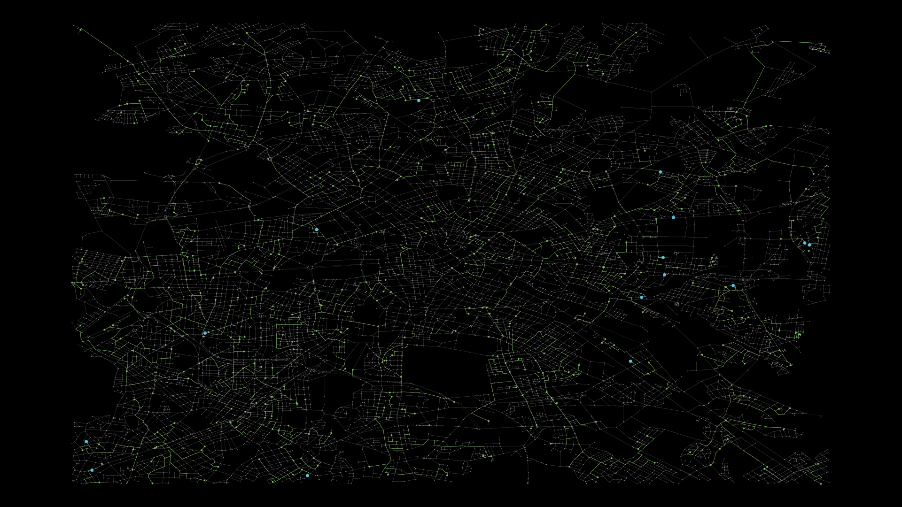

# MinFlowCity: City Graph Analysis and Visualization

## Overview

MinFlowCity is a Python program leveraging the power of several robust libraries such as `osmnx`, `networkx`,
and `manim` to perform city graph analysis and visualization. The goal is to construct a city's network graph with
different node types (such as suppliers, consumers, and neutrals) and then find the optimal solution for minimum cost
flow. The final output of the project is a visualization of this graph, which allows a more intuitive understanding of
the city's network structure and its optimal flow solution.

## Breakdown of Program

### City Graph Generation

The city graph generation utilizes the `osmnx` library which accesses OpenStreetMap (OSM) data for a specific location.
The raw data is then transformed into a Graph Data Frame used to construct our city graph. During the construction of
the city graph, nodes are assigned specific types: supplier, consumer, or neutral. The number of each node type is
adjustable.

### Minimum Cost Flow Solution

Once the city graph has been generated, the program calculates the minimum cost flow solution for the network using
the `networkx` library. 

* Each supply node provides "unlimited" flow (using super supply node idea)
* Each consumer node must consumer exactly one flow
* Each edge has unlimited capacity and a cost equivalent to its euclidian distance.

The program uses the `min_cost_flow` method from `networkx` to find the most cost-effective way to
distribute flow from suppliers to consumers.

### Visualization

The final step in the program is to visualize the graph and the optimal flow solution. The `manim` library is used for
this purpose. Each node type is depicted by a different color and size for easy identification. Additionally, the edges
part of the optimal solution are highlighted, providing a clear visual representation of the flow distribution across
the network.

## Adaptation

You can change the city or area for the analysis by adjusting the coordinates and distance parameters in
the `generate_city_graph` function. Similarly, you can also change the distribution of node types by altering the number
of suppliers and consumers.